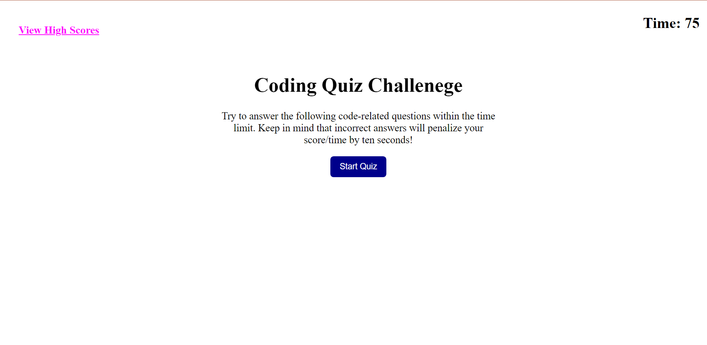

# JavaScript-Brain-Teaser

## Description

My motivation to start this quiz was because I was learning about JavaScript, so I wanted to imply my knowledge into this quiz, so other people can also be able to use it. Throughout building this website
I found out how to use texts through JavaScript and also make a counter go down with a reset when restarting the quiz. Lastly found out how to use the local storage into the code too. 

## Installation

N/A

## Usage

When the user wants to learn about JavaScript they can load up the page and quiz themselves and see how much they know, but for every wrong answer the time is deducted by 10 secods. 
There is also a high score the user can view at the very end to see how well they have performed.

https://josuehernand.github.io/JavaScript-Brain-Teaser/

## Credits

Worked alongside with Raymond Bautista: github.com/Raymond2811

## License

Used MIT License
